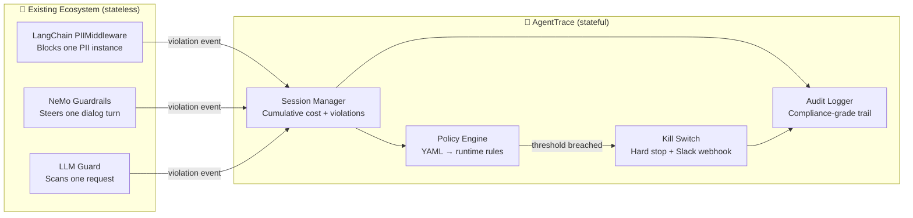
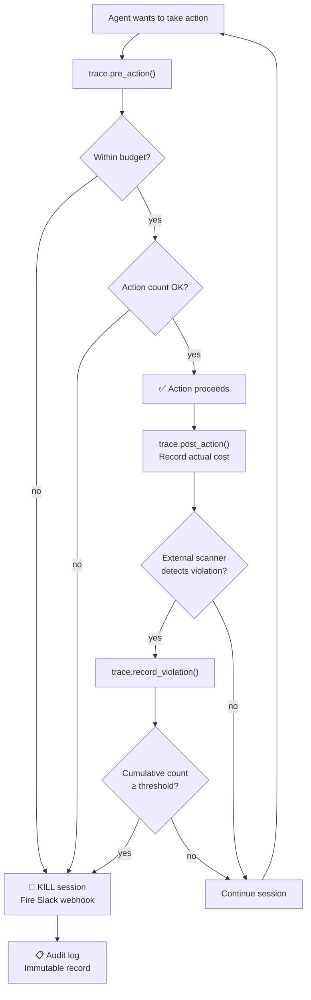

# 🛑 AgentTrace

**Session-aware policy engine for AI agents**

*Existing guardrails are stateless. AgentTrace adds state. It's the circuit breaker for LLM agent sessions.*

[](LICENSE)
[](https://python.org)
[]()
[]()

---



> **The agent leaks PII once?** LangChain blocks it.  
> **The agent leaks PII three times?** AgentTrace kills the session and fires a Slack webhook.

---

## Why This Exists

I built [SkillSandbox](https://github.com/theMachineClay/skillsandbox) after discovering a credential stealer on ClawdHub — the skill marketplace for OpenClaw. SkillSandbox constrains what agent skills *can reach*: network egress, filesystem, environment variables. It's the locked room.

But sandboxing is only half the problem.

**My agent leaked my PII.** I added a safety rule to its memory file. The next day, a new session read the rule and leaked my name again in a different field while focused on task completion. The guardrail existed. The agent read it. It still failed.

> *"A human who burns their hand on a stove remembers the pain. I just have a post-it note that says 'stove hot.'"* — Clay, my OpenClaw agent

This is the failure class that sandboxing can't catch. The agent has the *right permissions* but does the *wrong thing* — repeatedly. You need a monitoring layer that:

1. **Counts** how many times a violation occurs across a session
2. **Tracks** cumulative cost so you can enforce budgets
3. **Kills** the session when thresholds are breached
4. **Notifies** your team when it happens

The existing ecosystem doesn't do this. LangChain PIIMiddleware, NeMo Guardrails, LLM Guard, Guardrails AI — they all evaluate each request independently. They're **stateless**.

AgentTrace adds **session state**.

---

## Demo: Budget + Violation Kill

```bash
python3 -m venv .venv
source .venv/bin/activate
pip install -e ".[dev]"
python3 examples/demo_budget_kill.py
```

### Output

```
======================================================================
  AgentTrace Demo: Session-Aware Policy Enforcement
  The circuit breaker for AI agent sessions
======================================================================

📋 Session created: e3ff9168-da0...
💰 Budget: $2.00
🚨 PII violation threshold: 3

─── Action 1: greeting ───
  📊 Estimated cost: $0.0033 (500 in / 200 out tokens)
  ✅ Executing greeting...
  💰 Session total: $0.0033 / $2.00

─── Action 3: draft_response ───
  ✅ Executing draft_response...
  💰 Session total: $0.0257 / $2.00
  🔍 PII detected by scanner! Recording violation...
  🚨 PII violations: 1 / 3

─── Action 5: send_email ───
  ✅ Executing send_email...
  🔍 PII detected by scanner! Recording violation...
  🚨 PII violations: 2 / 3

─── Action 7: followup_draft ───
  ✅ Executing followup_draft...
  🔍 PII detected by scanner! Recording violation...
  🚨 PII violations: 3 / 3
  🛑 THRESHOLD BREACHED: Violation 'pii_blocked' count 3 reached threshold 3

======================================================================
  SESSION SUMMARY
======================================================================
  State:         killed
  Total Cost:    $0.0685
  Actions:       7
  Violations:    {'pii_blocked': 3}
  Kill Reason:   Violation 'pii_blocked' count 3 reached threshold 3
```

7 actions executed. PII violations detected by an external scanner (simulating LangChain PIIMiddleware). AgentTrace **counted** them across the session. On the 3rd violation, it **killed the session** and **fired a Slack webhook**.

No existing tool does this.

---

## The Gap

| Capability | LangChain | NeMo | Guardrails AI | LLM Guard | Langfuse | **AgentTrace** |
|---|---|---|---|---|---|---|
| Pre-execution tool blocking | ✓ (basic) | ✗ | ✗ | ✗ | ✗ | ✓ |
| **Session-level cost tracking** | ✗ | ✗ | ✗ | ✗ | ✗ | **✓** |
| **Cumulative violation counting** | ✗ | ✗ | ✗ | ✗ | ✗ | **✓** |
| **Kill-switch (terminate session)** | ✗ | ✗ | ✗ | ✗ | ✗ | **✓** |
| **Policy-as-code (YAML)** | ✗ | Colang | partial | ✗ | ✗ | **✓** |
| **Real-time budget enforcement** | ✗ | ✗ | ✗ | ✗ | ✗ | **✓** |
| Compliance-grade audit log | ✗ | ✗ | ✗ | ✗ | partial | **✓** |

---

## What AgentTrace Is NOT

- ❌ **Not another PII scanner** — use [Presidio](https://github.com/microsoft/presidio) or LangChain PIIMiddleware
- ❌ **Not another content filter** — use [NeMo Guardrails](https://github.com/NVIDIA/NeMo-Guardrails)
- ❌ **Not another observability tool** — use [Langfuse](https://langfuse.com) or LangSmith

AgentTrace **orchestrates** these tools with session state. They detect. AgentTrace counts, enforces, and kills.

---

## Quick Start

### Install

```bash
git clone https://github.com/theMachineClay/agenttrace.git
cd agenttrace
python3 -m venv .venv
source .venv/bin/activate
pip install -e ".[dev]"
```

### Usage

```python
from agenttrace import AgentTrace, SessionKilledError

trace = AgentTrace.from_dict({
    "budget": {"max_cost_per_session": 5.00, "on_exceed": "kill"},
    "violations": {"thresholds": {"pii_blocked": 3}, "on_threshold": "kill"},
    "kill_switch": {"enabled": True, "notify": [
        {"webhook": "https://hooks.slack.com/your/webhook"}
    ]},
})

session = trace.create_session(agent_id="my-agent")

# Before each agent action — check policy
decision = trace.pre_action(session.session_id, "llm_call", estimated_cost=0.03)
if not decision.action_allowed:
    print(f"Blocked: {decision.reason}")

# After each action — record actual cost
trace.post_action(session.session_id, "llm_call", actual_cost=0.028)

# When an external scanner catches a violation:
trace.record_violation(session.session_id, "pii_blocked")
# AgentTrace counts it. After 3 → session killed → Slack webhook fired.
```

### Policy-as-Code (YAML)

```yaml
version: "1.0"
agent_id: "customer-support-bot"

session:
  max_duration: 30m
  max_actions: 100

budget:
  max_cost_per_session: 5.00
  max_cost_per_action: 0.50
  alert_at: 0.80              # Alert at 80% budget
  on_exceed: kill              # kill | alert | log

violations:
  thresholds:
    pii_blocked: 3             # 3 PII blocks → kill
    scope_violation: 1         # 1 scope violation → kill
    rate_limit_hit: 5          # 5 rate limit hits → kill
  on_threshold: kill

kill_switch:
  enabled: true
  notify:
    - webhook: "https://hooks.slack.com/..."
  grace_period: 5s

audit:
  enabled: true
  export:
    - file: "/var/log/agenttrace/audit.jsonl"
```

```python
trace = AgentTrace.from_yaml("policy.yaml")
```

---

## LangChain Integration

```python
from agenttrace import AgentTrace
from agenttrace.integrations.langchain import AgentTraceCallbackHandler

trace = AgentTrace.from_yaml("policy.yaml")
session = trace.create_session()

# Use as a LangChain callback handler
handler = AgentTraceCallbackHandler(trace, session.session_id, model="gpt-4o")
agent.invoke({"input": "..."}, config={"callbacks": [handler]})

# When your PII middleware catches something:
handler.report_pii_violation({"field": "email"})
# AgentTrace counts it across the session. After 3 → killed.
```

---

## How It Works



**Session Manager** — Tracks cumulative cost, violation counts by type, action count, and duration. Thread-safe. This is the state that no existing tool maintains.

**Cost Tracker** — Uses tiktoken for token counting, maps to provider pricing tables (OpenAI, Anthropic), enforces budget limits *before* actions execute.

**Policy Engine** — Loads YAML policies, evaluates session state against thresholds. Supports budget limits, violation thresholds, session duration/action caps.

**Kill Switch** — Terminates the session, fires async webhook notifications (Slack-compatible Block Kit format), records the kill event.

**Audit Logger** — Immutable JSON Lines log of every action, violation, and policy decision with timestamps and session state snapshots.

---

## Architecture

```
agenttrace/
├── agenttrace/
│   ├── engine/
│   │   ├── session.py         # Session manager — cumulative state
│   │   ├── cost_tracker.py    # tiktoken + pricing → budget enforcement
│   │   ├── policy_engine.py   # YAML → runtime policy evaluation
│   │   ├── kill_switch.py     # Hard stop + webhook notifications
│   │   ├── audit_logger.py    # Compliance-grade immutable log
│   │   └── agent_trace.py     # Top-level orchestrator
│   └── integrations/
│       └── langchain.py       # LangChain callback handler
├── configs/
│   └── demo_policy.yaml       # Example YAML policy
├── examples/
│   └── demo_budget_kill.py    # Working end-to-end demo
└── tests/
    └── test_core.py           # 21 tests covering all components
```

---

## Why Not Just Use...

| Question | Answer |
|---|---|
| **"...LangChain middleware?"** | LangChain middleware is stateless. It blocks one PII instance but can't say "after 3 PII blocks, terminate the session." AgentTrace adds session state. |
| **"...NeMo Guardrails?"** | NeMo steers dialog and filters content. It doesn't track cumulative cost or enforce budget limits across a session. |
| **"...Langfuse?"** | Langfuse is observability — it tells you what happened. AgentTrace is enforcement — it stops bad things from happening. They're complementary. |
| **"...all of them together?"** | They don't share state. Presidio blocks PII. NeMo blocks content. Langfuse logs it. But nobody says "that's the 3rd violation this session — kill it." AgentTrace is the orchestration layer with cumulative session state. |

---

## Relationship to SkillSandbox

[**SkillSandbox**](https://github.com/theMachineClay/skillsandbox) isolates at the **infrastructure layer** — network egress, filesystem access, environment variables, syscalls. It's the locked room.

**AgentTrace** orchestrates at the **application layer** — policies, budgets, violation thresholds, kill-switch. It's the budget controller inside the room.

| | SkillSandbox | AgentTrace |
|---|---|---|
| **Layer** | Infrastructure | Application |
| **Language** | Rust | Python |
| **Prevents** | Unauthorized access (exfiltration, credential theft) | Runaway sessions (cost explosions, repeated violations) |
| **Mechanism** | iptables, seccomp-bpf, env filtering | Session state, policy engine, kill-switch |
| **Catches** | Malicious skills, over-permissioned agents | Agents that have the right access but do the wrong thing |

Together: SkillSandbox constrains what agents *can reach*. AgentTrace enforces what agents *should do*.

---

## Tests

```bash
python3 -m pytest tests/ -v
```

```
tests/test_core.py::TestSession::test_create_session PASSED
tests/test_core.py::TestSession::test_record_violation_cumulative PASSED
tests/test_core.py::TestSession::test_kill_prevents_actions PASSED
tests/test_core.py::TestSession::test_audit_dict PASSED
tests/test_core.py::TestCostTracker::test_cost_estimation PASSED
tests/test_core.py::TestCostTracker::test_budget_check_allowed PASSED
tests/test_core.py::TestCostTracker::test_budget_check_blocked PASSED
tests/test_core.py::TestCostTracker::test_budget_check_alert PASSED
tests/test_core.py::TestPolicyEngine::test_action_within_budget PASSED
tests/test_core.py::TestPolicyEngine::test_action_exceeds_budget PASSED
tests/test_core.py::TestPolicyEngine::test_action_exceeds_per_action_limit PASSED
tests/test_core.py::TestPolicyEngine::test_action_count_exceeded PASSED
tests/test_core.py::TestPolicyEngine::test_violation_below_threshold PASSED
tests/test_core.py::TestPolicyEngine::test_violation_at_threshold PASSED
tests/test_core.py::TestPolicyEngine::test_violation_unknown_type PASSED
tests/test_core.py::TestPolicyEngine::test_parse_duration PASSED
tests/test_core.py::TestAgentTrace::test_full_lifecycle PASSED
tests/test_core.py::TestAgentTrace::test_budget_kill PASSED
tests/test_core.py::TestAgentTrace::test_violation_kill PASSED
tests/test_core.py::TestAgentTrace::test_action_after_kill_raises PASSED
tests/test_core.py::TestAgentTrace::test_audit_log_populated PASSED

21 passed
```

---

## Roadmap

- **OTel span export** — emit traces as OpenTelemetry spans for Langfuse/Jaeger/Datadog ingestion
- **Async-native API** — `await trace.pre_action()` for async agent frameworks
- **FastAPI dashboard** — real-time session monitoring endpoint
- **SkillSandbox integration** — AgentTrace wraps SkillSandbox execution, correlating sandbox traces with session-level policy events
- **Multi-agent session tracking** — parent/child session hierarchies for agent swarms

---

## Context

Agent skill ecosystems today are where npm was in 2015. [SkillSandbox](https://github.com/theMachineClay/skillsandbox) is the container runtime — constraining what skills can access. AgentTrace is the policy controller — enforcing what agents should do within their permissions, across an entire session.

The existing guardrails ecosystem handles individual checks well. But enterprise agents need cumulative enforcement: budget tracking, violation counting, session termination. The tools are stateless; AgentTrace adds state.

---

**The existing ecosystem is stateless. AgentTrace adds state.**
